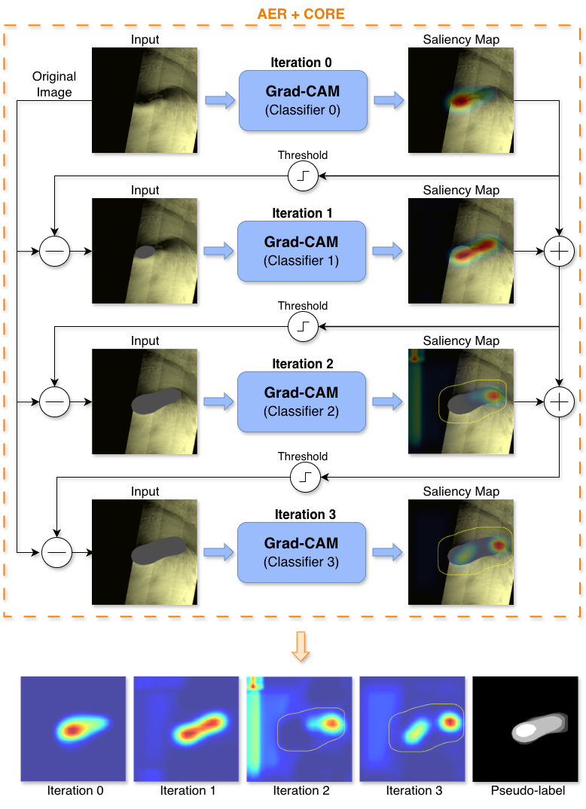

# wsss-polar-low-pseudolabels

**Stage 1: Pseudo-label Generation for Weakly Supervised Polar Low Segmentation in Sentinel-1 SAR Imagery**



This repository implements **Stage 1** of the AER+CORE+DB framework described in the paper *"Weakly Supervised Polar Low Segmentation in Sentinel-1 SAR Imagery"*. It generates dense pixel-level pseudo-labels from image-level classification labels using an enhanced Adversarial Erasing (AER) pipeline with Constrained Ordinal Region Expansion (CORE). The pseudo-labels produced here serve as weak supervision for training a segmentation network in Stage 2.

## Method overview

Standard classifiers trained with image-level labels focus on the most discriminative features (e.g., the cyclone eye) and miss the full spatial extent of the target object. Adversarial Erasing addresses this by iteratively:

1. **Training** a classifier on the current version of the dataset.
2. **Extracting** Grad-CAM heatmaps to identify discriminative regions.
3. **Erasing** those regions from the images and repeating.

Each iteration forces the classifier to discover new, complementary features. This repository extends vanilla AER with the **CORE** module, which activates after a configurable number of iterations to spatially constrain region growth via morphological dilation of the previous mask. This prevents the mining process from drifting into disconnected background regions.

The output is a set of **ordinal multi-class pseudo-labels**, where each pixel is assigned a confidence tier based on the iteration at which it was discovered. Earlier iterations correspond to higher confidence.

## Project structure

```
.
├── run.py                  # Hydra entry point
├── conf/                   # Hydra configuration files
│   ├── polar_lows.yaml     # Main config for Polar Lows (AER+CORE)
│   ├── polar_lows_std_aer.yaml  # Standard AER baseline
│   ├── polar_lows_cam.yaml # Single Grad-CAM baseline
│   ├── bus.yaml            # Breast Ultrasound (BUS) dataset
│   ├── voc_binary.yaml     # PASCAL VOC (person class)
│   ├── data/               # Dataset-specific configs
│   ├── mode/               # Training mode configs
│   ├── training/           # Model, optimizer, scheduler configs
│   ├── hardware/           # Device configs
│   └── logger/             # Neptune logger configs
├── src/
│   ├── attributions/       # Grad-CAM and Integrated Gradients
│   ├── data/               # Datasets, dataloaders, augmentation, erasing I/O
│   ├── models/
│   │   ├── torch/          # Xception classifier
│   │   ├── lightning_wrappers/  # PyTorch Lightning training wrappers
│   │   ├── erase_strategies.py  # Heatmap-based region erasing
│   │   └── configs.py      # Model and erasing configuration
│   ├── post/               # Mask generation (binary and multi-class)
│   ├── train/
│   │   ├── mode/
│   │   │   └── train_adv_er.py  # Main adversarial erasing pipeline
│   │   ├── setup.py        # Training setup (model, dataloaders, trainer)
│   │   └── logger.py       # Neptune experiment logger
│   └── utils/              # Seeds, factory functions, constants
├── requirements.txt
└── images/
```

### Key hyperparameters

| Parameter | Description | Default (PL) |
|-----------|-------------|--------------|
| `mode.max_iterations` | Number of AER iterations | 7 |
| `mode.threshold` | Grad-CAM binarization threshold | 0.7 |
| `mode.heatmap_method` | Attribution method (`gradcam`, `xgradcam`, `gradcam++`, `layercam`, `scorecam`) | `gradcam` |
| `mode.area_envelope.start_iteration` | Iteration at which CORE activates | 3 |
| `mode.area_envelope.scale` | CORE envelope dilation scale (lambda) | 0.3 |
| `mode.fill_color` | Value used to fill erased regions | 0 |

## Datasets

The pipeline supports three datasets:

- **Sentinel-1 Polar Lows** — SAR imagery of polar lows from [Grahn and Bianchi (2022)](https://doi.org/10.1109/TGRS.2022.3204886). 1,982 geocoded samples (318 positive, 1,664 negative), resized to 512x512.
- **BUS** — [Breast Ultrasound Lesion Segmentation](https://doi.org/10.1038/s41597-025-04562-3) dataset. Benign and malignant tumors merged into positive class. Resized to 512x512.
- **PASCAL VOC 2012** — [Person class](http://www.pascal-network.org/challenges/VOC/voc2012/workshop/index.html) binarized as foreground. Resized to 480x480.

Dataset paths are configured in `conf/data/`.

## Outputs

After running the pipeline, the following outputs are generated:

- **Heatmaps** (`.pt` tensors and `.png` visualizations) for each image at each iteration.
- **Binary masks** — all discovered regions merged into a single foreground mask.
- **Multi-class ordinal masks** — each pixel labeled with its discovery iteration (higher value = higher confidence).
- **Negative masks** — masks applied to negative images during training.

These pseudo-labels are consumed by Stage 2 to train a SegFormer segmentation network with Dynamic Bootstrapping loss.